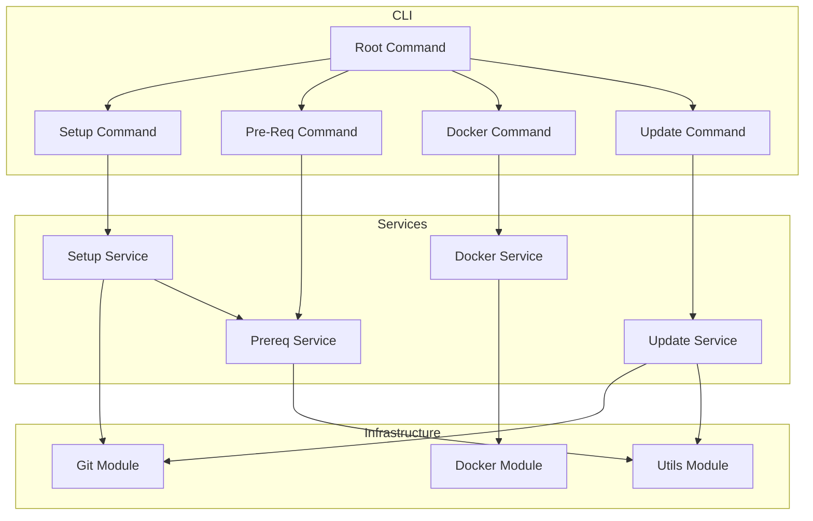

# Architecture

## Project Structure

```
whiterose/
├── cmd/                      # CLI commands (Cobra)
│   ├── root.go              # Root command
│   ├── setup.go             # Setup command
│   ├── preReq.go            # Pre-requisites command
│   ├── docker.go            # Docker command
│   └── update.go            # Update command
├── internal/                # Clean Architecture layers
│   ├── interfaces/          # SOLID interfaces
│   ├── services/            # Service implementations
│   ├── domain/
│   │   ├── entities/        # Domain entities
│   │   └── application/    # Application services
│   └── infrastructure/
├── git/                     # Git operations
├── docker/                  # Docker operations
├── prereq/                  # Pre-requisites validation
├── setup/                   # Setup orchestration
├── update/                  # Update operations
├── utils/                   # Utilities
├── .github/workflows/       # CI/CD
├── Makefile                # Build targets
└── Dockerfile              # Container image
```

## Component Diagram



## Layer Responsibilities

| Layer | Purpose |
|-------|---------|
| `cmd/` | CLI entry points, Cobra commands |
| `internal/services/` | Business logic, orchestration |
| `internal/interfaces/` | Contracts for dependency injection |
| `internal/domain/` | Domain entities, business rules |
| `git/`, `docker/`, `utils/` | Infrastructure adapters |