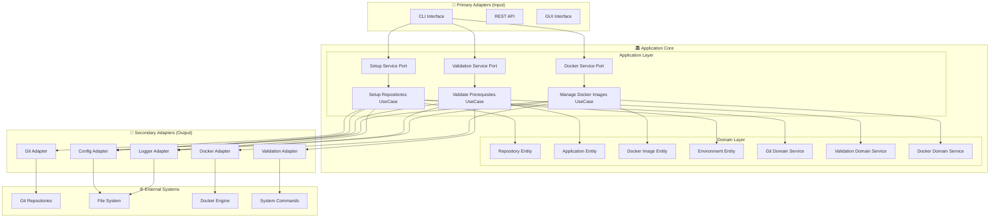
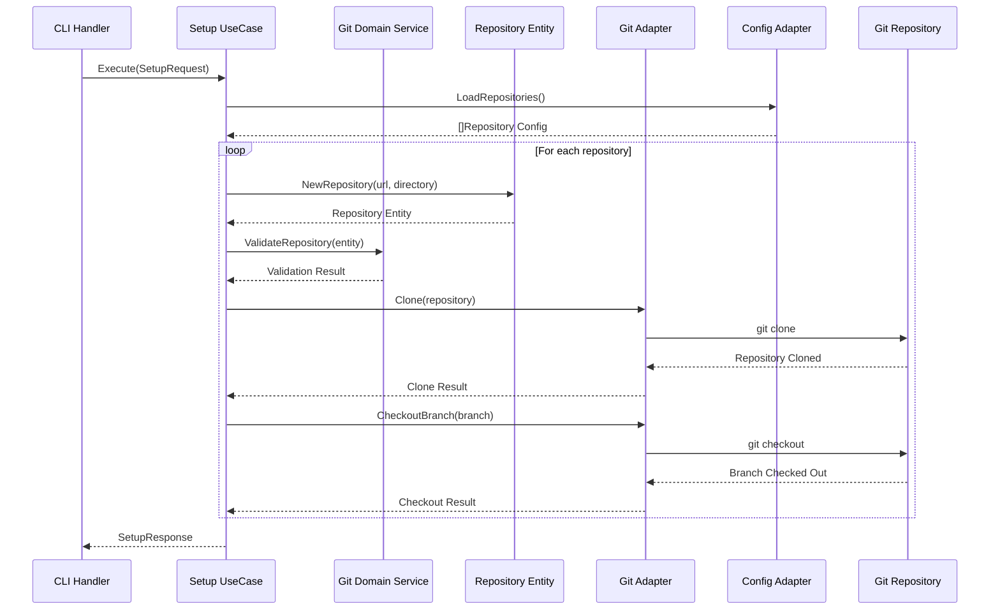
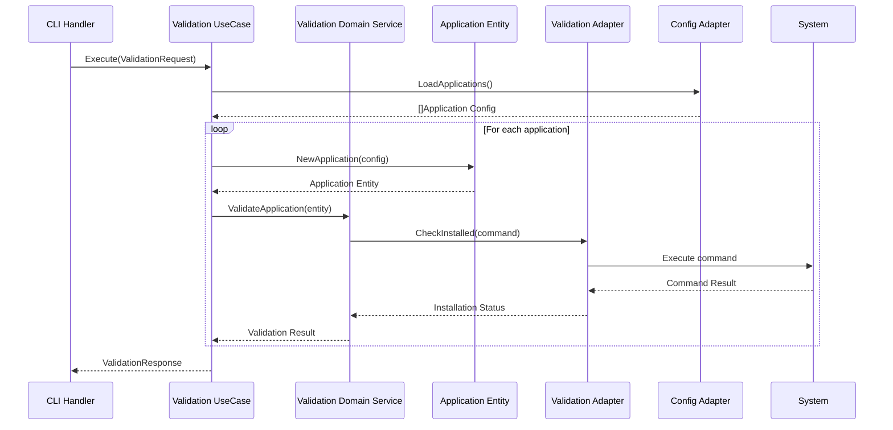
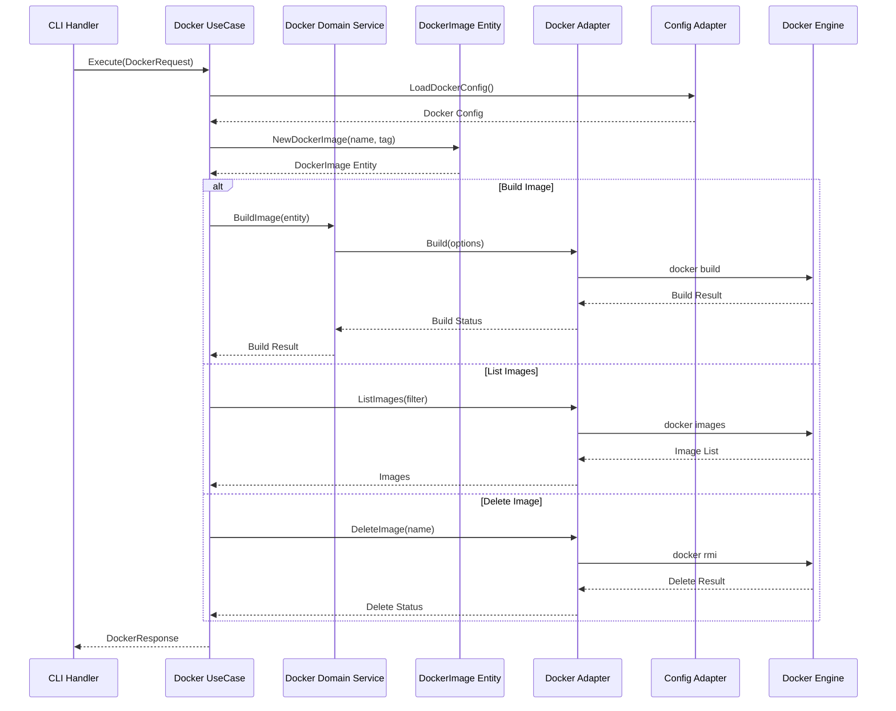
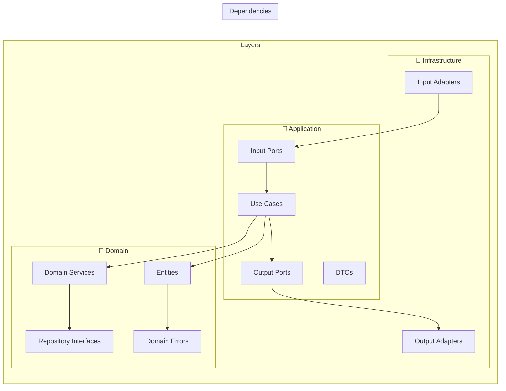
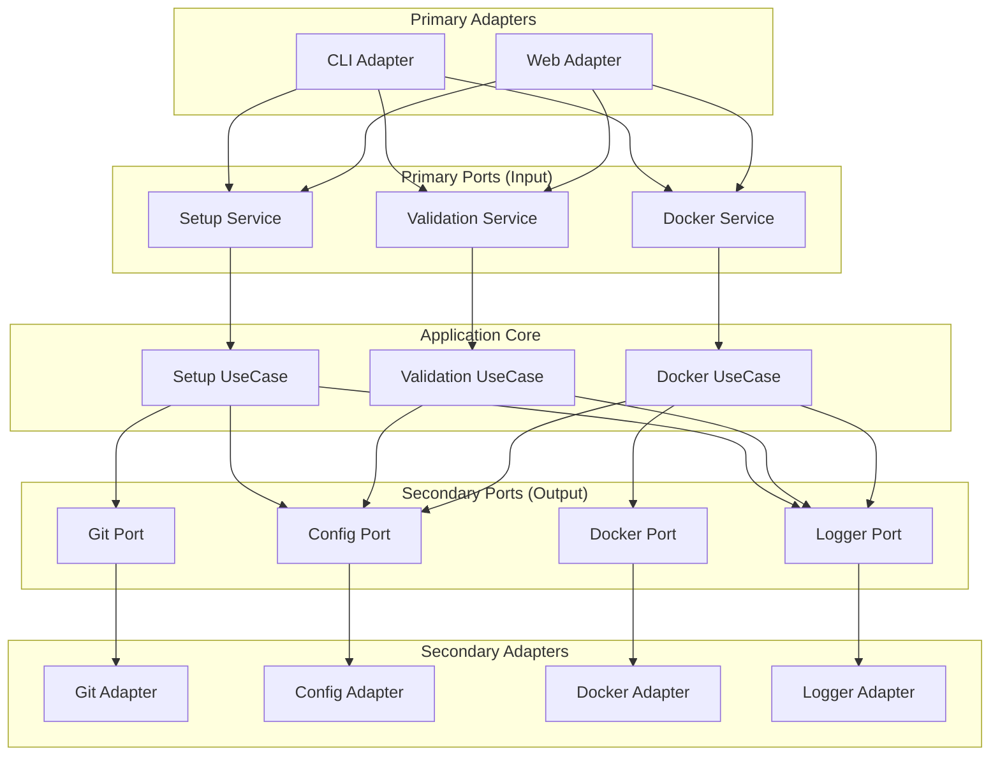
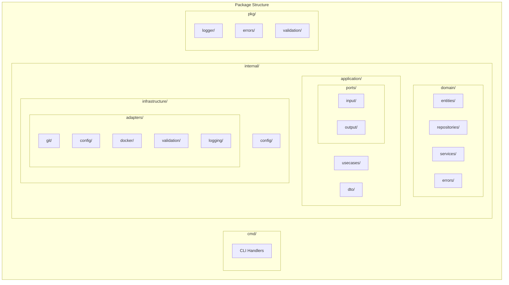
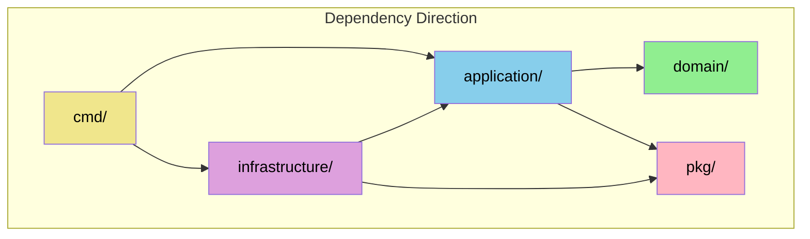
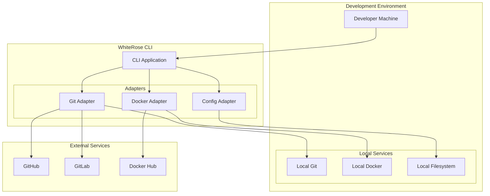
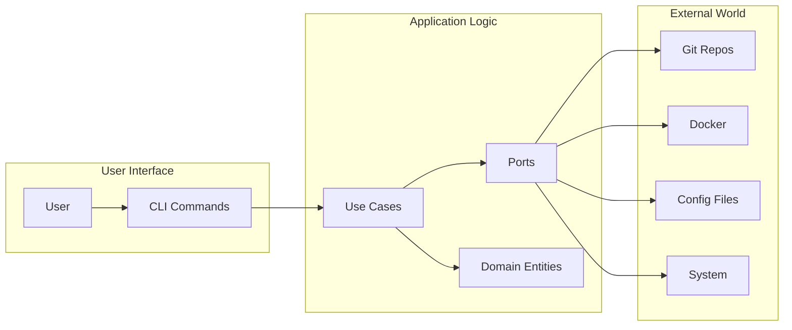

# 🏗️ Hexagonal Architecture Diagrams

## 🎯 Architecture Overview

## 🔄 Data Flow - Repository Setup

## 🧪 Prerequisites Validation Flow

## 🐳 Docker Management Flow

## 🏛️ Architecture Layers

## 🔌 Ports & Adapters Pattern

## 📦 Package Structure

## 🔄 Dependency Flow

## 🚀 Deployment Architecture

## 📊 Component Interaction Overview

These diagrams show how hexagonal architecture keeps the application core isolated from external details, allowing easy testing and maintenance. The dependency direction always points inward, ensuring the domain remains pure and independent of external frameworks.
