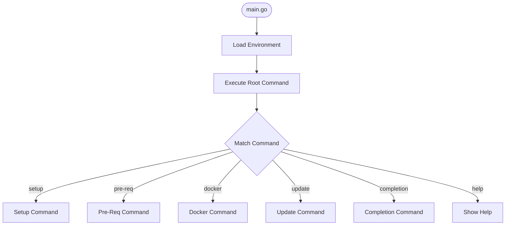
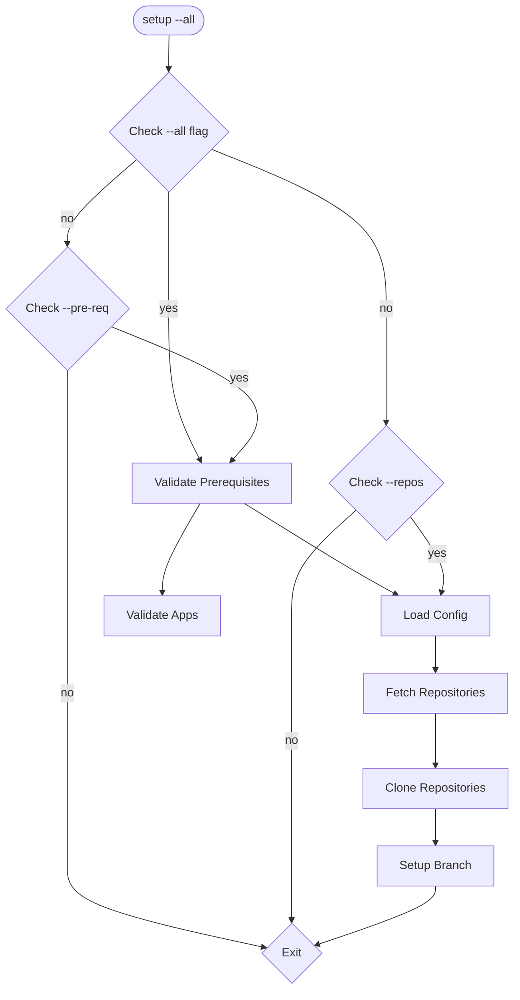
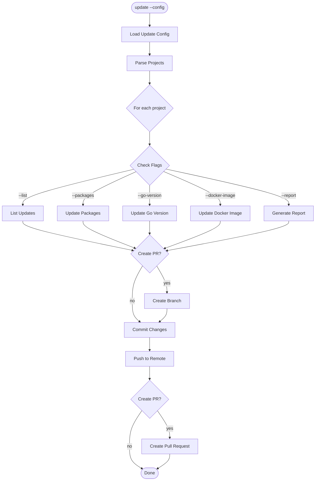
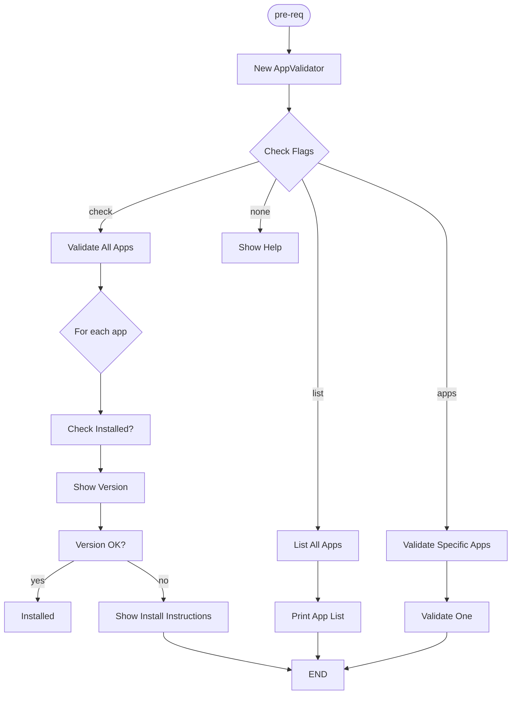
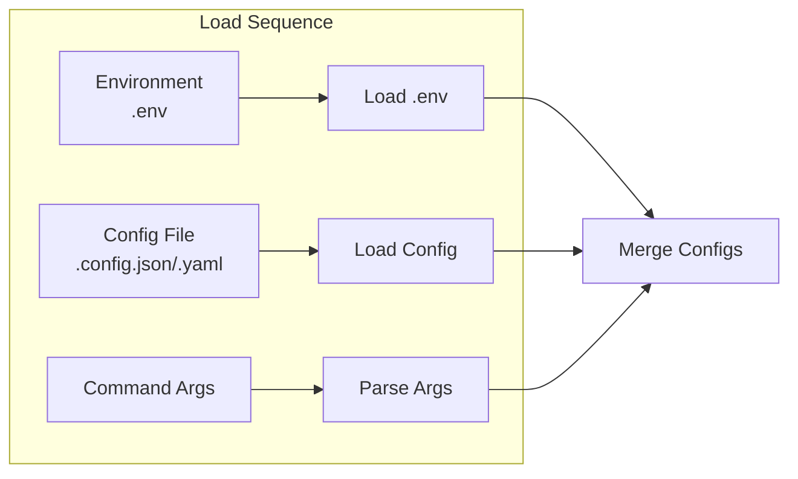
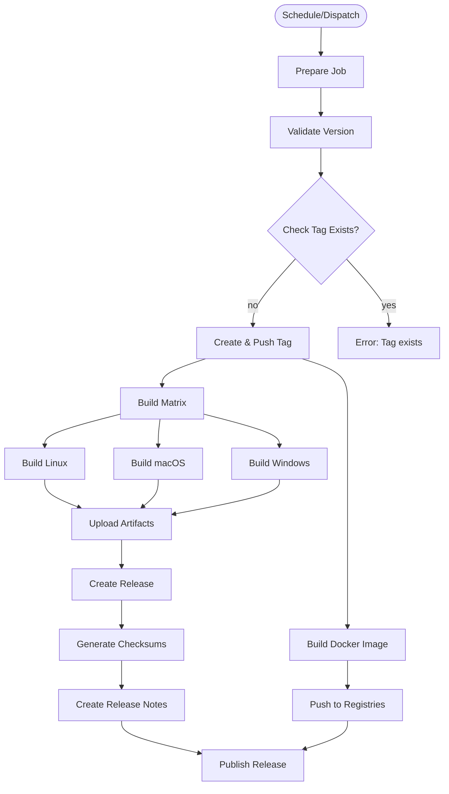

# Execution Flow

## Command Execution Flow

### Main Entry Point

### Setup Command Flow

### Update Command Flow

### Pre-Req Command Flow

## Configuration Flow

## GitHub Actions Workflow

