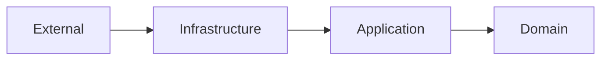

# ✨ Best Practices for Hexagonal Architecture

## 🎯 Fundamental Principles

### 1. **Dependency Rule**

Dependencies always point inward:



### 2. **Interface Segregation**

Create small and specific interfaces:

```go
// ❌ Avoid - Interface too broad
type Repository interface {
    Create(entity interface{}) error
    Update(entity interface{}) error
    Delete(id string) error
    GetByID(id string) (interface{}, error)
    GetAll() ([]interface{}, error)
    Search(query string) ([]interface{}, error)
}

// ✅ Prefer - Specific interfaces
type RepositoryWriter interface {
    Create(entity Entity) error
    Update(entity Entity) error
    Delete(id string) error
}

type RepositoryReader interface {
    GetByID(id string) (Entity, error)
    GetAll() ([]Entity, error)
}
```

### 3. **Single Responsibility**

Each component has a single responsibility:

```go
// ✅ Focused Use Case
type SetupRepositoriesUseCase struct {
    gitPort    ports.GitPort
    configPort ports.ConfigPort
    logger     ports.LoggerPort
}

func (uc *SetupRepositoriesUseCase) Execute(ctx context.Context, req dto.SetupRequest) (*dto.SetupResponse, error) {
    // Only orchestration - no implementation
    config, err := uc.configPort.LoadRepositories(ctx)
    if err != nil {
        return nil, err
    }
    
    for _, repo := range config.Repositories {
        if err := uc.gitPort.Clone(ctx, repo); err != nil {
            uc.logger.Error(ctx, "Clone failed", map[string]interface{}{
                "repo": repo.URL,
                "error": err,
            })
        }
    }
    
    return uc.buildResponse(config), nil
}
```

## 🏗️ Folder Structure

### Recommended Organization

```bash
internal/
├── domain/                 # ❤️  Core Business Logic
│   ├── entities/           # Business objects
│   ├── repositories/       # Persistence contracts
│   ├── services/           # Complex business rules
│   └── errors/             # Domain-specific errors
├── application/            # 🔄 Orchestration Layer
│   ├── usecases/           # Application use cases
│   ├── ports/              # Input/output contracts
│   │   ├── input/          # Primary ports (driving)
│   │   └── output/         # Secondary ports (driven)
│   └── dto/                # Data Transfer Objects
└── infrastructure/         # 🔌 External Concerns
    ├── adapters/           # Port implementations
    │   ├── git/            # Git adapter
    │   ├── config/         # Configuration adapter
    │   ├── docker/         # Docker adapter
    │   └── logging/        # Logging adapter
    ├── external/           # External clients
    └── config/             # Infrastructure configuration
```

## 💡 Important Patterns

### 1. **Repository Pattern**

```go
// Domain - Define the contract
type UserRepository interface {
    Save(ctx context.Context, user *User) error
    FindByID(ctx context.Context, id string) (*User, error)
    FindByEmail(ctx context.Context, email string) (*User, error)
}

// Infrastructure - Implement the contract
type PostgreSQLUserRepository struct {
    db *sql.DB
}

func (r *PostgreSQLUserRepository) Save(ctx context.Context, user *User) error {
    // PostgreSQL-specific implementation
}
```

### 2. **Factory Pattern**

```go
// Domain Service Factory
type GitServiceFactory interface {
    CreateGitService(authType AuthType) GitService
}

type gitServiceFactory struct{}

func (f *gitServiceFactory) CreateGitService(authType AuthType) GitService {
    switch authType {
    case AuthTypeSSH:
        return NewSSHGitService()
    case AuthTypeHTTPS:
        return NewHTTPSGitService()
    default:
        return NewDefaultGitService()
    }
}
```

### 3. **Strategy Pattern**

```go
// Strategy for different authentication types
type AuthenticationStrategy interface {
    Authenticate(ctx context.Context, credentials Credentials) (Auth, error)
}

type SSHAuthStrategy struct{}
func (s *SSHAuthStrategy) Authenticate(ctx context.Context, creds Credentials) (Auth, error) {
    // SSH implementation
}

type HTTPSAuthStrategy struct{}
func (h *HTTPSAuthStrategy) Authenticate(ctx context.Context, creds Credentials) (Auth, error) {
    // HTTPS implementation
}
```

## 🧪 Testing Best Practices

### 1. **Test Doubles Hierarchy**

```go
// 1. Dummy - Just fills parameters
type DummyLogger struct{}
func (d *DummyLogger) Log(msg string) {} // Does nothing

// 2. Stub - Returns predefined values
type StubConfigPort struct {
    repositories []Repository
}
func (s *StubConfigPort) LoadRepositories(ctx context.Context) ([]Repository, error) {
    return s.repositories, nil
}

// 3. Mock - Verifies behavior
type MockGitPort struct {
    mock.Mock
}
func (m *MockGitPort) Clone(ctx context.Context, repo Repository) error {
    args := m.Called(ctx, repo)
    return args.Error(0)
}
```

### 2. **Test Builders**

```go
// Builder to create test objects
type RepositoryBuilder struct {
    repo *Repository
}

func NewRepositoryBuilder() *RepositoryBuilder {
    return &RepositoryBuilder{
        repo: &Repository{
            URL:       "https://github.com/user/repo.git",
            Directory: "repo",
            Branch:    "main",
        },
    }
}

func (b *RepositoryBuilder) WithURL(url string) *RepositoryBuilder {
    b.repo.URL = url
    return b
}

func (b *RepositoryBuilder) WithSSHAuth() *RepositoryBuilder {
    b.repo.AuthMethod = AuthenticationMethod{
        Type: AuthTypeSSH,
        SSHKey: SSHKeyConfig{Name: "id_rsa"},
    }
    return b
}

func (b *RepositoryBuilder) Build() *Repository {
    return b.repo
}

// Usage in test
func TestGitService_Clone(t *testing.T) {
    repo := NewRepositoryBuilder().
        WithURL("git@github.com:user/repo.git").
        WithSSHAuth().
        Build()
    
    // ... rest of test
}
```

## 🔒 Error Handling

### 1. **Domain Errors**

```go
// Typed errors for domain
type DomainError struct {
    Code    ErrorCode
    Message string
    Cause   error
    Context map[string]interface{}
}

// Specific errors
var (
    ErrRepositoryNotFound = DomainError{
        Code:    "REPOSITORY_NOT_FOUND",
        Message: "Repository not found",
    }
    
    ErrInvalidCredentials = DomainError{
        Code:    "INVALID_CREDENTIALS",
        Message: "Invalid authentication credentials",
    }
)
```

### 2. **Error Wrapping**

```go
func (uc *SetupUseCase) Execute(ctx context.Context, req dto.SetupRequest) (*dto.SetupResponse, error) {
    config, err := uc.configPort.LoadRepositories(ctx)
    if err != nil {
        return nil, fmt.Errorf("failed to load configuration: %w", err)
    }
    
    for _, repo := range config.Repositories {
        if err := uc.cloneRepository(ctx, repo); err != nil {
            // Log the error but continue processing
            uc.logger.Error(ctx, "Repository clone failed", map[string]interface{}{
                "repository": repo.URL,
                "error": err.Error(),
            })
        }
    }
    
    return uc.buildResponse(), nil
}
```

## 📊 Logging & Observability

### 1. **Structured Logging**

```go
type LoggerPort interface {
    Debug(ctx context.Context, msg string, fields map[string]interface{})
    Info(ctx context.Context, msg string, fields map[string]interface{})
    Warn(ctx context.Context, msg string, fields map[string]interface{})
    Error(ctx context.Context, msg string, fields map[string]interface{})
}

// Consistent usage
func (uc *SetupUseCase) Execute(ctx context.Context, req dto.SetupRequest) (*dto.SetupResponse, error) {
    uc.logger.Info(ctx, "Starting repository setup", map[string]interface{}{
        "request_id": ctx.Value("request_id"),
        "repos_count": len(req.Repositories),
    })
    
    // ...processing...
    
    uc.logger.Info(ctx, "Repository setup completed", map[string]interface{}{
        "request_id": ctx.Value("request_id"),
        "successful": len(successfulRepos),
        "failed": len(failedRepos),
        "duration_ms": time.Since(startTime).Milliseconds(),
    })
}
```

### 2. **Metrics & Tracing**

```go
type MetricsPort interface {
    IncrementCounter(name string, tags map[string]string)
    RecordGauge(name string, value float64, tags map[string]string)
    RecordHistogram(name string, value float64, tags map[string]string)
}

func (uc *SetupUseCase) Execute(ctx context.Context, req dto.SetupRequest) (*dto.SetupResponse, error) {
    startTime := time.Now()
    
    defer func() {
        duration := time.Since(startTime)
        uc.metrics.RecordHistogram("setup_duration_seconds", duration.Seconds(), map[string]string{
            "operation": "setup_repositories",
        })
    }()
    
    // ...processing...
    
    uc.metrics.IncrementCounter("repositories_processed", map[string]string{
        "status": "success",
    })
}
```

## 🔄 Configuration Management

### 1. **Environment-based Config**

```go
type Config struct {
    Database struct {
        Host     string `env:"DB_HOST" envDefault:"localhost"`
        Port     int    `env:"DB_PORT" envDefault:"5432"`
        Username string `env:"DB_USER" envDefault:"postgres"`
        Password string `env:"DB_PASS"`
    }
    
    Git struct {
        DefaultBranch string        `env:"GIT_DEFAULT_BRANCH" envDefault:"main"`
        Timeout       time.Duration `env:"GIT_TIMEOUT" envDefault:"30s"`
    }
    
    Logger struct {
        Level  string `env:"LOG_LEVEL" envDefault:"info"`
        Format string `env:"LOG_FORMAT" envDefault:"json"`
    }
}
```

### 2. **Configuration Validation**

```go
func (c *Config) Validate() error {
    if c.Database.Password == "" {
        return errors.New("database password is required")
    }
    
    if c.Git.Timeout <= 0 {
        return errors.New("git timeout must be positive")
    }
    
    validLevels := []string{"debug", "info", "warn", "error"}
    if !contains(validLevels, c.Logger.Level) {
        return fmt.Errorf("invalid log level: %s", c.Logger.Level)
    }
    
    return nil
}
```

## 🚀 Performance Best Practices

### 1. **Context Usage**

```go
// ✅ Always pass context
func (uc *SetupUseCase) Execute(ctx context.Context, req dto.SetupRequest) (*dto.SetupResponse, error) {
    // Timeout for complete operation
    ctx, cancel := context.WithTimeout(ctx, 5*time.Minute)
    defer cancel()
    
    return uc.processRepositories(ctx, req.Repositories)
}

// ✅ Check cancellation in loops
func (uc *SetupUseCase) processRepositories(ctx context.Context, repos []Repository) error {
    for _, repo := range repos {
        select {
        case <-ctx.Done():
            return ctx.Err()
        default:
            if err := uc.processRepository(ctx, repo); err != nil {
                uc.logger.Error(ctx, "Failed to process repository", map[string]interface{}{
                    "repo": repo.URL,
                    "error": err,
                })
            }
        }
    }
    return nil
}
```

### 2. **Concurrent Processing**

```go
func (uc *SetupUseCase) processRepositoriesConcurrently(ctx context.Context, repos []Repository) (*dto.SetupResponse, error) {
    const maxConcurrency = 5
    semaphore := make(chan struct{}, maxConcurrency)
    
    var wg sync.WaitGroup
    results := make(chan dto.RepositoryResult, len(repos))
    
    for _, repo := range repos {
        wg.Add(1)
        go func(repo Repository) {
            defer wg.Done()
            
            // Acquire semaphore
            semaphore <- struct{}{}
            defer func() { <-semaphore }()
            
            result := uc.processRepository(ctx, repo)
            results <- result
        }(repo)
    }
    
    // Wait for all goroutines to complete
    go func() {
        wg.Wait()
        close(results)
    }()
    
    // Collect results
    var allResults []dto.RepositoryResult
    for result := range results {
        allResults = append(allResults, result)
    }
    
    return &dto.SetupResponse{Results: allResults}, nil
}
```

## 🔐 Security Best Practices

### 1. **Credential Management**

```go
// ✅ Interface for secure credential management
type CredentialStore interface {
    GetSecret(ctx context.Context, key string) (string, error)
    SetSecret(ctx context.Context, key, value string) error
    DeleteSecret(ctx context.Context, key string) error
}

// ✅ Don't hardcode credentials
func (a *GitAdapter) Clone(ctx context.Context, repo Repository) error {
    var auth transport.AuthMethod
    
    switch repo.AuthMethod.Type {
    case AuthTypeSSH:
        privateKey, err := a.credStore.GetSecret(ctx, "ssh_private_key")
        if err != nil {
            return fmt.Errorf("failed to get SSH key: %w", err)
        }
        auth, err = ssh.NewPublicKeys("git", []byte(privateKey), "")
        if err != nil {
            return fmt.Errorf("failed to create SSH auth: %w", err)
        }
    case AuthTypeHTTPS:
        token, err := a.credStore.GetSecret(ctx, "git_token")
        if err != nil {
            return fmt.Errorf("failed to get git token: %w", err)
        }
        auth = &http.BasicAuth{
            Username: repo.AuthMethod.Username,
            Password: token,
        }
    }
    
    // ...clone logic...
}
```

### 2. **Input Validation**

```go
func (uc *SetupUseCase) Execute(ctx context.Context, req dto.SetupRequest) (*dto.SetupResponse, error) {
    // Validate input
    if err := uc.validateRequest(req); err != nil {
        return nil, fmt.Errorf("invalid request: %w", err)
    }
    
    // ...processing...
}

func (uc *SetupUseCase) validateRequest(req dto.SetupRequest) error {
    if len(req.Repositories) == 0 {
        return errors.New("at least one repository is required")
    }
    
    for i, repo := range req.Repositories {
        if err := uc.validateRepository(repo); err != nil {
            return fmt.Errorf("invalid repository at index %d: %w", i, err)
        }
    }
    
    return nil
}

func (uc *SetupUseCase) validateRepository(repo dto.RepositoryConfig) error {
    // Validate URL
    if !isValidGitURL(repo.URL) {
        return fmt.Errorf("invalid git URL: %s", repo.URL)
    }
    
    // Validate path injection
    if strings.Contains(repo.Directory, "..") {
        return fmt.Errorf("invalid directory path: %s", repo.Directory)
    }
    
    return nil
}
```

## 📦 Dependency Injection

### 1. **Constructor Injection**

```go
// ✅ Use constructor injection
type SetupUseCase struct {
    gitPort    ports.GitPort
    configPort ports.ConfigPort
    logger     ports.LoggerPort
    metrics    ports.MetricsPort
}

func NewSetupUseCase(
    gitPort ports.GitPort,
    configPort ports.ConfigPort,
    logger ports.LoggerPort,
    metrics ports.MetricsPort,
) *SetupUseCase {
    return &SetupUseCase{
        gitPort:    gitPort,
        configPort: configPort,
        logger:     logger,
        metrics:    metrics,
    }
}
```

### 2. **DI Container**

```go
type Container struct {
    // Singletons
    logger     ports.LoggerPort
    metrics    ports.MetricsPort
    credStore  ports.CredentialStore
    
    // Repositories
    gitPort    ports.GitPort
    configPort ports.ConfigPort
    
    // Use Cases
    setupUC    usecases.SetupUseCase
    prereqUC   usecases.PrerequisiteUseCase
}

func NewContainer(config *Config) *Container {
    c := &Container{}
    
    // Wire dependencies in correct order
    c.wireSingletons(config)
    c.wireRepositories(config)
    c.wireUseCases()
    
    return c
}

func (c *Container) wireSingletons(config *Config) {
    c.logger = logging.NewStructuredLogger(config.Logger)
    c.metrics = metrics.NewPrometheusMetrics()
    c.credStore = credentials.NewEnvCredentialStore()
}

func (c *Container) wireRepositories(config *Config) {
    c.gitPort = git.NewGoGitAdapter(c.logger, c.credStore)
    c.configPort = configadapter.NewJSONConfigAdapter(config.ConfigPath)
}

func (c *Container) wireUseCases() {
    c.setupUC = usecases.NewSetupUseCase(
        c.gitPort,
        c.configPort,
        c.logger,
        c.metrics,
    )
}
```

## 🎯 Summary Checklist

### ✅ Architecture Principles

- [ ] Dependencies point inward (Domain ← Application ← Infrastructure)
- [ ] Interfaces are small and focused
- [ ] Each component has single responsibility
- [ ] Business logic is in Domain layer
- [ ] Use Cases orchestrate but don't implement

### ✅ Code Quality

- [ ] Comprehensive error handling with typed errors
- [ ] Structured logging with context
- [ ] Input validation on all boundaries
- [ ] Secure credential management
- [ ] Performance considerations (context, concurrency)

### ✅ Testing

- [ ] Unit tests for Domain (>95% coverage)
- [ ] Unit tests for Application with mocks (>90% coverage)
- [ ] Integration tests for Infrastructure (>80% coverage)
- [ ] E2E tests for critical user journeys

### ✅ Documentation

- [ ] Clear README with setup instructions
- [ ] API documentation for all public interfaces
- [ ] Architecture decision records (ADRs)
- [ ] Code comments for complex business logic

Following these practices, you will have a robust, testable, and maintainable application using hexagonal architecture.
