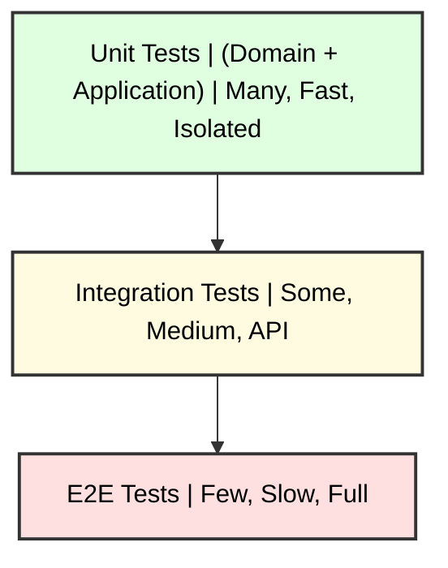

# 🧪 Testing Guide

## 🎯 Testing Strategy in Hexagonal Architecture

Hexagonal architecture greatly facilitates testing by allowing complete isolation of layers. This guide shows how to implement effective tests for each layer.

## 📊 Test Pyramid



## 🏛️ Tests by Layer

### 1. **Domain Layer Tests** (Unit Tests)

#### Characteristics Domain Layer Tests

- **Fast**: No external dependencies
- **Isolated**: Only business rules
- **Pure**: No I/O, no side effects

#### Example - Entity Tests

```go
// internal/domain/entities/repository_test.go
package entities_test

import (
    "testing"
    "github.com/stretchr/testify/assert"
    "github.com/fabianoflorentino/whiterose/internal/domain/entities"
)

func TestNewRepository_ValidInput(t *testing.T) {
    // Arrange
    url := "https://github.com/user/repo.git"
    directory := "repo"
    
    // Act
    repo, err := entities.NewRepository(url, directory)
    
    // Assert
    assert.NoError(t, err)
    assert.NotNil(t, repo)
    assert.Equal(t, url, repo.URL)
    assert.Equal(t, directory, repo.Directory)
    assert.Equal(t, "repo", repo.Name)
    assert.NotEmpty(t, repo.ID)
}

func TestNewRepository_InvalidURL(t *testing.T) {
    // Arrange & Act
    repo, err := entities.NewRepository("", "directory")
    
    // Assert
    assert.Error(t, err)
    assert.Nil(t, repo)
    assert.Contains(t, err.Error(), "invalid repository URL")
}

func TestRepository_SetBranch(t *testing.T) {
    // Arrange
    repo, _ := entities.NewRepository("https://github.com/user/repo.git", "repo")
    branch := "development"
    
    // Act
    err := repo.SetBranch(branch)
    
    // Assert
    assert.NoError(t, err)
    assert.Equal(t, branch, repo.Branch)
}

func TestRepository_SetAuthentication_SSH(t *testing.T) {
    // Arrange
    repo, _ := entities.NewRepository("git@github.com:user/repo.git", "repo")
    auth := entities.AuthenticationMethod{
        Type: entities.AuthTypeSSH,
        SSHKey: entities.SSHKeyConfig{
            Path: "/home/user/.ssh",
            Name: "id_rsa",
        },
    }
    
    // Act
    err := repo.SetAuthentication(auth)
    
    // Assert
    assert.NoError(t, err)
    assert.Equal(t, entities.AuthTypeSSH, repo.AuthMethod.Type)
    assert.True(t, repo.IsSSH())
    assert.False(t, repo.IsHTTPS())
}
```

#### Example - Domain Service Tests

```go
// internal/domain/services/git_service_test.go
package services_test

import (
    "context"
    "testing"
    "github.com/stretchr/testify/assert"
    "github.com/fabianoflorentino/whiterose/internal/domain/services"
    "github.com/fabianoflorentino/whiterose/internal/domain/entities"
)

func TestGitDomainService_ValidateRepository(t *testing.T) {
    // Arrange
    service := services.NewGitDomainService()
    ctx := context.Background()
    
    repo, _ := entities.NewRepository("https://github.com/user/repo.git", "repo")
    
    // Act
    err := service.ValidateRepository(ctx, repo)
    
    // Assert
    assert.NoError(t, err)
}

func TestGitDomainService_ValidateRepository_InvalidAuth(t *testing.T) {
    // Arrange
    service := services.NewGitDomainService()
    ctx := context.Background()
    
    repo, _ := entities.NewRepository("https://github.com/user/repo.git", "repo")
    invalidAuth := entities.AuthenticationMethod{
        Type: entities.AuthTypeHTTPS,
        // Username e Token vazios - inválido
    }
    repo.SetAuthentication(invalidAuth)
    
    // Act
    err := service.ValidateRepository(ctx, repo)
    
    // Assert
    assert.Error(t, err)
    assert.Contains(t, err.Error(), "username and token are required")
}
```

### 2. **Application Layer Tests** (Unit Tests with Mocks)

#### Characteristics Layer Tests

- **Isolated Use Cases**: Mocked dependencies
- **Behavior**: Tests orchestration, not implementation
- **Contracts**: Verifies interaction with ports

#### Example - Use Case Tests

```go
// internal/application/usecases/setup_repositories_test.go
package usecases_test

import (
    "context"
    "testing"
    "github.com/stretchr/testify/assert"
    "github.com/stretchr/testify/mock"
    
    "github.com/fabianoflorentino/whiterose/internal/application/dto"
    "github.com/fabianoflorentino/whiterose/internal/application/usecases"
    "github.com/fabianoflorentino/whiterose/internal/domain/entities"
)

// Mocks
type MockGitPort struct {
    mock.Mock
}

func (m *MockGitPort) Clone(ctx context.Context, options entities.CloneOptions) error {
    args := m.Called(ctx, options)
    return args.Error(0)
}

func (m *MockGitPort) Checkout(ctx context.Context, repoPath, branch string) error {
    args := m.Called(ctx, repoPath, branch)
    return args.Error(0)
}

type MockConfigPort struct {
    mock.Mock
}

func (m *MockConfigPort) LoadRepositories(ctx context.Context) (*entities.ConfigData, error) {
    args := m.Called(ctx)
    return args.Get(0).(*entities.ConfigData), args.Error(1)
}

type MockLogger struct {
    mock.Mock
}

func (m *MockLogger) Info(ctx context.Context, msg string, fields map[string]interface{}) {
    m.Called(ctx, msg, fields)
}

func (m *MockLogger) Error(ctx context.Context, msg string, fields map[string]interface{}) {
    m.Called(ctx, msg, fields)
}

func TestSetupRepositoriesUseCase_Execute_Success(t *testing.T) {
    // Arrange
    mockGitPort := new(MockGitPort)
    mockConfigPort := new(MockConfigPort)
    mockLogger := new(MockLogger)
    
    useCase := usecases.NewSetupRepositoriesUseCase(
        mockGitPort,
        mockConfigPort,
        mockLogger,
    )
    
    // Mock expectations
    configData := &entities.ConfigData{
        Repositories: []entities.RepositoryConfig{
            {
                URL:       "https://github.com/user/repo.git",
                Directory: "repo",
            },
        },
    }
    
    mockConfigPort.On("LoadRepositories", mock.Anything).Return(configData, nil)
    mockGitPort.On("Clone", mock.Anything, mock.AnythingOfType("entities.CloneOptions")).Return(nil)
    mockGitPort.On("Checkout", mock.Anything, "repo", "development").Return(nil)
    mockLogger.On("Info", mock.Anything, mock.Anything, mock.Anything).Return()
    
    ctx := context.Background()
    req := &dto.SetupRequest{
        TargetDirectory: "/tmp/repos",
    }
    
    // Act
    response, err := useCase.Execute(ctx, req)
    
    // Assert
    assert.NoError(t, err)
    assert.NotNil(t, response)
    assert.Len(t, response.Results, 1)
    assert.True(t, response.Results[0].Success)
    
    // Verify mock expectations
    mockConfigPort.AssertExpectations(t)
    mockGitPort.AssertExpectations(t)
    mockLogger.AssertExpectations(t)
}

func TestSetupRepositoriesUseCase_Execute_ConfigLoadFails(t *testing.T) {
    // Arrange
    mockGitPort := new(MockGitPort)
    mockConfigPort := new(MockConfigPort)
    mockLogger := new(MockLogger)
    
    useCase := usecases.NewSetupRepositoriesUseCase(
        mockGitPort,
        mockConfigPort,
        mockLogger,
    )
    
    // Mock expectations
    mockConfigPort.On("LoadRepositories", mock.Anything).Return(
        (*entities.ConfigData)(nil), 
        errors.New("config file not found"),
    )
    
    ctx := context.Background()
    req := &dto.SetupRequest{}
    
    // Act
    response, err := useCase.Execute(ctx, req)
    
    // Assert
    assert.Error(t, err)
    assert.Nil(t, response)
    assert.Contains(t, err.Error(), "failed to load config")
    
    mockConfigPort.AssertExpectations(t)
}
```

### 3. **Infrastructure Tests** (Integration Tests)

#### Characteristics

- **Real dependencies**: Tests integrations
- **Controlled environment**: Docker, temporary filesystem
- **Contracts**: Verifies adapters implement ports correctly

#### Example - Git Adapter Tests

```go
// internal/infrastructure/adapters/git/go_git_adapter_test.go
package git_test

import (
    "context"
    "io/ioutil"
    "os"
    "path/filepath"
    "testing"
    "github.com/stretchr/testify/assert"
    "github.com/stretchr/testify/require"
    
    "github.com/fabianoflorentino/whiterose/internal/infrastructure/adapters/git"
    "github.com/fabianoflorentino/whiterose/internal/domain/entities"
)

func TestGoGitAdapter_Clone_Success(t *testing.T) {
    // Arrange
    adapter := git.NewGoGitAdapter()
    ctx := context.Background()
    
    // Create temporary directory
    tempDir, err := ioutil.TempDir("", "git_test")
    require.NoError(t, err)
    defer os.RemoveAll(tempDir)
    
    options := entities.CloneOptions{
        URL:       "https://github.com/octocat/Hello-World.git", // Public repo
        Directory: filepath.Join(tempDir, "hello-world"),
        Auth:      nil, // Public repo
    }
    
    // Act
    err = adapter.Clone(ctx, options)
    
    // Assert
    assert.NoError(t, err)
    assert.DirExists(t, options.Directory)
    assert.FileExists(t, filepath.Join(options.Directory, ".git"))
}

func TestGoGitAdapter_Clone_InvalidURL(t *testing.T) {
    // Arrange
    adapter := git.NewGoGitAdapter()
    ctx := context.Background()
    
    tempDir, err := ioutil.TempDir("", "git_test")
    require.NoError(t, err)
    defer os.RemoveAll(tempDir)
    
    options := entities.CloneOptions{
        URL:       "https://invalid-url-that-does-not-exist.com/repo.git",
        Directory: filepath.Join(tempDir, "invalid"),
    }
    
    // Act
    err = adapter.Clone(ctx, options)
    
    // Assert
    assert.Error(t, err)
    assert.NotDirExists(t, options.Directory)
}
```

#### Example - Config Adapter Tests

```go
// internal/infrastructure/adapters/config/json_config_test.go
package config_test

import (
    "context"
    "io/ioutil"
    "os"
    "testing"
    "github.com/stretchr/testify/assert"
    "github.com/stretchr/testify/require"
    
    "github.com/fabianoflorentino/whiterose/internal/infrastructure/adapters/config"
)

func TestJSONConfigAdapter_LoadRepositories_Success(t *testing.T) {
    // Arrange
    configContent := `{
        "repositories": [
            {
                "url": "https://github.com/user/repo1.git",
                "directory": "repo1"
            },
            {
                "url": "git@github.com:user/repo2.git",
                "directory": "repo2"
            }
        ]
    }`
    
    // Create temporary config file
    tempFile, err := ioutil.TempFile("", "config_*.json")
    require.NoError(t, err)
    defer os.Remove(tempFile.Name())
    
    _, err = tempFile.WriteString(configContent)
    require.NoError(t, err)
    tempFile.Close()
    
    adapter := config.NewJSONConfigAdapter(tempFile.Name())
    ctx := context.Background()
    
    // Act
    configData, err := adapter.LoadRepositories(ctx)
    
    // Assert
    assert.NoError(t, err)
    assert.NotNil(t, configData)
    assert.Len(t, configData.Repositories, 2)
    assert.Equal(t, "https://github.com/user/repo1.git", configData.Repositories[0].URL)
    assert.Equal(t, "repo1", configData.Repositories[0].Directory)
}

func TestJSONConfigAdapter_LoadRepositories_FileNotFound(t *testing.T) {
    // Arrange
    adapter := config.NewJSONConfigAdapter("/path/that/does/not/exist.json")
    ctx := context.Background()
    
    // Act
    configData, err := adapter.LoadRepositories(ctx)
    
    // Assert
    assert.Error(t, err)
    assert.Nil(t, configData)
    assert.Contains(t, err.Error(), "failed to read config file")
}
```

### 4. **End-to-End Tests** (E2E Tests)

#### Characteristics E2E Tests

- **Complete system**: CLI to adapters
- **Real environment**: Filesystem, Git, Docker
- **User scenarios**: Complete flows

#### Example - CLI E2E Tests

```go
// tests/e2e/setup_test.go
package e2e_test

import (
    "os"
    "os/exec"
    "path/filepath"
    "testing"
    "github.com/stretchr/testify/assert"
    "github.com/stretchr/testify/require"
)

func TestSetupCommand_E2E(t *testing.T) {
    if testing.Short() {
        t.Skip("Skipping E2E test in short mode")
    }
    
    // Arrange - Setup test environment
    tempDir := setupTestEnvironment(t)
    defer os.RemoveAll(tempDir)
    
    // Create test config file
    configContent := `{
        "repositories": [
            {
                "url": "https://github.com/octocat/Hello-World.git",
                "directory": "hello-world"
            }
        ]
    }`
    
    configFile := filepath.Join(tempDir, ".config.json")
    err := ioutil.WriteFile(configFile, []byte(configContent), 0644)
    require.NoError(t, err)
    
    // Set environment variables
    os.Setenv("CONFIG_FILE", configFile)
    defer os.Unsetenv("CONFIG_FILE")
    
    // Act - Execute CLI command
    cmd := exec.Command("./whiterose", "setup")
    cmd.Dir = tempDir
    output, err := cmd.CombinedOutput()
    
    // Assert
    assert.NoError(t, err, "Command output: %s", string(output))
    assert.Contains(t, string(output), "Cloning")
    assert.Contains(t, string(output), "hello-world")
    
    // Verify repository was cloned
    repoDir := filepath.Join(tempDir, "hello-world")
    assert.DirExists(t, repoDir)
    assert.FileExists(t, filepath.Join(repoDir, ".git"))
    assert.FileExists(t, filepath.Join(repoDir, "README"))
}

func setupTestEnvironment(t *testing.T) string {
    tempDir, err := ioutil.TempDir("", "whiterose_e2e_*")
    require.NoError(t, err)
    
    // Create .env file
    envContent := `
GIT_USER=testuser
GIT_TOKEN=testtoken
SSH_KEY_PATH=` + filepath.Join(tempDir, ".ssh") + `
SSH_KEY_NAME=id_rsa
`
    
    err = ioutil.WriteFile(filepath.Join(tempDir, ".env"), []byte(envContent), 0644)
    require.NoError(t, err)
    
    return tempDir
}
```

## 🛠️ Test Setup

### Test Utilities

```go
// pkg/testutils/test_helpers.go
package testutils

import (
    "context"
    "io/ioutil"
    "os"
    "path/filepath"
    "testing"
    "github.com/stretchr/testify/require"
)

// CreateTempDir creates temporary directory for tests
func CreateTempDir(t *testing.T, prefix string) string {
    tempDir, err := ioutil.TempDir("", prefix)
    require.NoError(t, err)
    
    t.Cleanup(func() {
        os.RemoveAll(tempDir)
    })
    
    return tempDir
}

// CreateTempFile creates temporary file with content
func CreateTempFile(t *testing.T, dir, pattern, content string) string {
    file, err := ioutil.TempFile(dir, pattern)
    require.NoError(t, err)
    
    _, err = file.WriteString(content)
    require.NoError(t, err)
    
    err = file.Close()
    require.NoError(t, err)
    
    return file.Name()
}

// SetupTestContext creates context for tests
func SetupTestContext() context.Context {
    return context.Background()
}

// AssertNoError is a helper for error assertions
func AssertNoError(t *testing.T, err error, msgAndArgs ...interface{}) {
    if err != nil {
        t.Errorf("Unexpected error: %v", err)
        if len(msgAndArgs) > 0 {
            t.Errorf("Additional info: %v", msgAndArgs)
        }
        t.FailNow()
    }
}
```

### Makefile for Tests

```makefile
# Makefile
.PHONY: test test-unit test-integration test-e2e test-coverage

# Run all tests
test:
  go test ./...

# Run only unit tests (fast)
test-unit:
  go test -short ./internal/domain/... ./internal/application/...

# Run integration tests
test-integration:
  go test ./internal/infrastructure/...

# Run E2E tests
test-e2e:
  go test ./tests/e2e/...

# Run tests with coverage
test-coverage:
  go test -coverprofile=coverage.out ./...
  go tool cover -html=coverage.out -o coverage.html

# Run tests with race detection
test-race:
  go test -race ./...

# Run benchmarks
test-bench:
  go test -bench=. ./...

# Clean test cache
test-clean:
  go clean -testcache
```

## 📊 Quality Metrics

### Coverage Targets

- **Domain Layer**: >95% (critical business rules)
- **Application Layer**: >90% (important orchestration)
- **Infrastructure Layer**: >80% (adapters with external dependencies)
- **Overall**: >85%

### Useful Commands

```bash
# Coverage per package
go test -cover ./internal/domain/entities/
go test -cover ./internal/application/usecases/
go test -cover ./internal/infrastructure/adapters/git/

# Detailed coverage
go test -coverprofile=coverage.out ./...
go tool cover -func=coverage.out

# Coverage HTML
go tool cover -html=coverage.out

# Benchmark
go test -bench=. -benchmem ./...

# Race detection
go test -race ./...
```

## 🚀 CI/CD Pipeline

### GitHub Actions exemplo

```yaml
# .github/workflows/test.yml
name: Tests

on: [push, pull_request]

jobs:
  test:
    runs-on: ubuntu-latest
    
    steps:
    - uses: actions/checkout@v2
    
    - name: Set up Go
      uses: actions/setup-go@v2
      with:
        go-version: 1.25
    
    - name: Run unit tests
      run: make test-unit
    
    - name: Run integration tests
      run: make test-integration
    
    - name: Run E2E tests
      run: make test-e2e
    
    - name: Generate coverage
      run: make test-coverage
    
    - name: Upload coverage
      uses: codecov/codecov-action@v1
      with:
        file: ./coverage.out
```

## 🎯 Best Practices Summary

### ✅ Do's

- **Isolate layers** in tests
- **Use mocks** for external dependencies
- **Test behaviors**, not implementations
- **Keep tests fast** (especially unit tests)
- **Use proper setup/teardown**
- **Document special cases** in tests
- **Test edge cases, not just happy path**

### ❌ Don'ts

- **Don't test internal implementations**
- **Don't use real dependencies** in unit tests
- **Don't ignore intermittently failing tests**
- **Don't copy and paste** test setup

This testing guide ensures that the hexagonal architecture is fully validated and maintains high quality throughout development.
